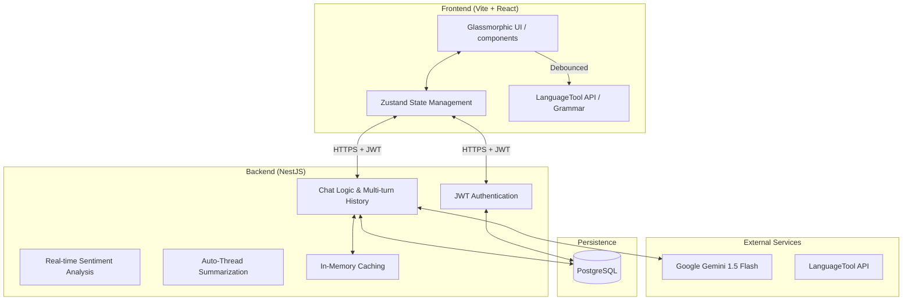
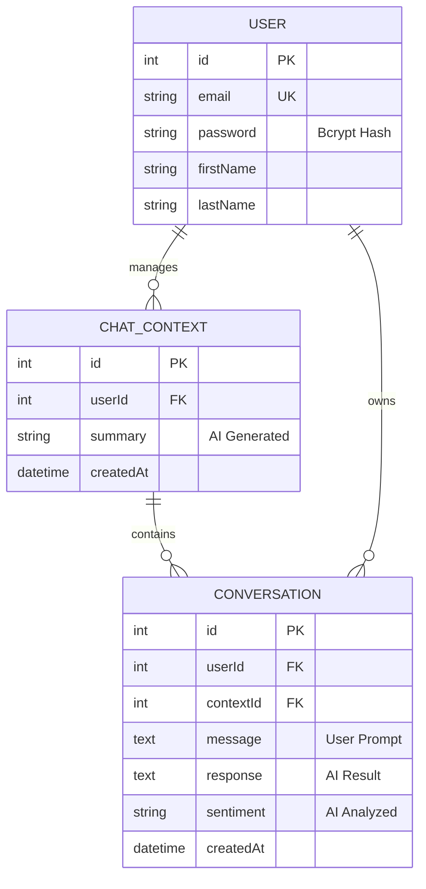
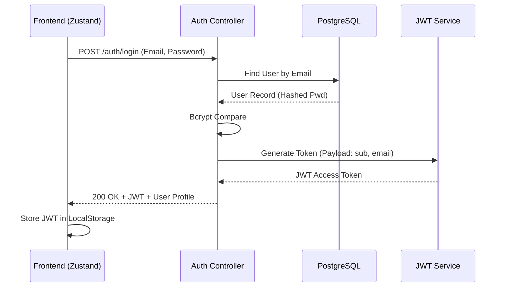
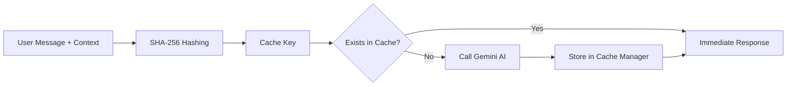

# SupportIQ - Premium AI-Powered Support Dashboard

SupportIQ is a high-end, visual-first AI chat application engineered for professional support environments. It combines a **Liquidmorphic/Glassmorphism UI** with a robust **NestJS/PostgreSQL** backend, leveraging **Google Gemini AI** for intelligent, context-aware conversations.

---

## 🚀 Quick Start (Local Development)

The fastest way to run the project is using the root-level orchestration.

### 1. Prerequisites
- **Node.js** (v18+)
- **Docker** (for the database)

### 2. Environment Configuration
Create a root `.env` file and provide your **GEMINI_API_KEY**. You can also check individual `.env` files in `server/` and `client/` for specific overrides.

### 3. Run the Project

From the root directory, run these two commands:

```bash
# 1. Start the PostgreSQL database
docker-compose up -d db

# 2. Start both Frontend and Backend concurrently
npm run dev
```

- **Frontend**: [http://localhost:5173](http://localhost:5173)
- **Backend API**: [http://localhost:5000/api](http://localhost:5000/api)
- **Database**: Port 5435 (External)

---

## 🐳 Docker (Full Stack)

If you prefer to run the *entire* stack (including server and client) as isolated containers:

```bash
docker compose up --build -d
```

- **Frontend**: [http://localhost:8080](http://localhost:8080)
- **Backend API**: [http://localhost:5050/api](http://localhost:5050/api)

---

## ✨ Key Features

- **AI Chat Experience**: Dynamic responses using Google's Gemini Pro model.
- **Sentiment Analysis**: Real-time analysis of assistant responses (Positive, Neutral, Negative) displayed with visual indicators.
- **Typing Indicator**: Smooth, animated feedback while the AI is processing requests.
- **Session Management**: Thread-based conversations with AI-generated titles.
- **Responsive Design**: Fully optimized for Desktop, Tablet, and Mobile screens.
- **JWT Authentication**: Secure user sessions and historical conversation persistence.
- **Liquidmorphic UI**: Premium Glassmorphism aesthetics with animated mesh gradients.

---

## 🏗️ System Architecture

SupportIQ follows a modern distributed architecture, ensuring clear separation of concerns between the reactive frontend, the structured backend, and external intelligence services.



---

## 📊 Database Schema (ERD)

Data in SupportIQ is strictly relational, ensuring conversation integrity and multi-user isolation.



---

## 🔒 Security Workflow (Auth & Authz)

SupportIQ implements a two-tier security model combining state-of-the-art authentication (Identity) and authorization (Access Control).

### 1. Authentication Handshake


### 2. Authorization (Guarded Access)
Every request to the `/api/chat` endpoints is intercepted by a logic-gate:

-   **Guard**: `JwtAuthGuard` checks for a valid Bearer token.
-   **Strategy**: `JwtStrategy` validates the token signature and secret.
-   **Context**: Upon success, a `User` entity is injected into the request, ensuring users only see their own threads (`id` mapping).

---

## 🧠 Core Logic & Caching Strategy

### Deterministic Caching (Performance)
To reduce latency and Gemini API costs, SupportIQ implements a **Deterministic Cache Key Generation** system in the `ChatService`:



*   **Logic**: Every AI response, sentiment analysis, and thread summary is hashed against its unique payload.
*   **Result**: Identical prompts return instantaneous results with **zero API consumption**.

---

## 📡 API Reference

### Authentication
| Endpoint | Method | Role |
| :--- | :--- | :--- |
| `/api/auth/signup` | POST | User onboarding |
| `/api/auth/login` | POST | Identity verification |

### Chat & Intelligence (Guarded)
| Endpoint | Method | Feature |
| :--- | :--- | :--- |
| `/api/chat` | POST | Mult-turn AI Chat |
| `/api/chat/contexts` | GET | List Conversation Threads |
| `/api/chat/context/:id/messages` | GET | Thread History Retrieval |
| `/api/chat/refine` | POST | AI Prompt Engineering |

---

## 🛠️ Tech Stack

### Frontend
- **Framework**: React 19 (Vite)
- **Styling**: Vanilla CSS (Modern Glassmorphism)
- **Icons**: Lucide React
- **Animations**: Framer Motion
- **State Management**: Zustand
- **Grammar API**: LanguageTool

### Backend
- **Framework**: NestJS (TypeScript)
- **Database**: PostgreSQL
- **ORM**: TypeORM
- **AI**: Google GenAI SDK (Gemini 1.5 Flash)
- **Caching**: NestJS Cache Manager

---

## 🔧 Local Development Setup

If you prefer to run services individually:

### 1. Root Orchestration (Recommended)
```bash
npm install        # Install root dependencies (concurrently)
npm run dev        # Starts DB (if docker up), Server, and Client
```

### 2. Manual Setup
If you need to run them in separate terminals:
- **Database**: `docker-compose up -d db`
- **Backend**: `cd server && npm run start:dev` (Port 5000)
- **Frontend**: `cd client && npm run dev` (Port 5173)

---

## 🧪 API Testing (Postman)

A pre-configured Postman collection is available for rapid backend testing and integration verification.

### 1. Import Collection
Import the [SupportIQ.postman_collection.json](file:///c:/Error/aitask/SupportIQ.postman_collection.json) directly into Postman.

### 2. Features Included
- **Automated Token Management**: The `Login` request includes a post-response script that automatically updates the `{{token}}` variable for all subsequent Chat requests.
- **Environment Variables**: Uses `{{base_url}}` (default: `http://localhost:5000`) for seamless switching between local and production environments.
- **Full Coverage**: Includes Signup, Login, Multi-turn Chat, Thread History, and AI Prompt Refinement.

---

## 🐳 Docker Architecture

SupportIQ leverages Docker for consistent environments and simplified deployment. The architecture consists of three orchestrated services:

### Service Breakdown
1.  **`db`**: A `postgres:16-alpine` database service with health-check monitoring and persistent volume mapping (`pgdata`).
2.  **`server`**: The NestJS backend. Wait until the database is ready (`db: service_healthy`) before initiating its connection pool.
3.  **`client`**: The React/Vite frontend. Built using custom `Dockerfile` with the `VITE_API_URL` injected at build-time to ensure seamless communication with the backend container.

### Fast Rebuilds
The system uses tiered caching in the `Dockerfile` to ensure that standard code changes don't require re-installing the entire `node_modules` layer.

---

## ⚙️ Environment Variables

The application is configured via a root-level `.env` file. Below are the critical configuration keys:

### Backend Configuration
| Key | Default | Description |
| :--- | :--- | :--- |
| `PORT` | `5000` | The internal server port. |
| `DB_HOST` | `db` | Database host (use `db` within Docker). |
| `DB_NAME` | `nestjs_chat` | Target PostgreSQL database name. |
| `JWT_SECRET` | `super-secret...` | Secret key for signing user session tokens. |
| `GEMINI_API_KEY` | `Required` | Your Google Gemini AI API key. |

## 🏗️ Engineering Standards & Credits

SupportIQ is built with a focus on visual excellence, security, and scalable AI logic.

- **Logic Design**: SOLID Principles, DRY Architecture, and Type-safe interfaces throughout.
- **Premium UX**: Liquid Gradients, Glassmorphism, and distraction-free layout.
- **Security**: JWT-based Authentication, Bcrypt encryption, and Guard-based Authorization.
- **AI Engine**: Multi-turn history building with Google Gemini 1.5 Flash and deterministic SHA-256 caching.