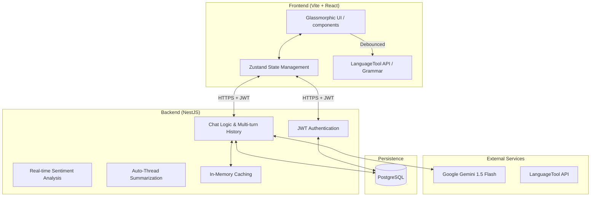

# SupportIQ - Premium AI-Powered Support Dashboard

SupportIQ is a high-end, visual-first AI chat application engineered for professional support environments. It combines a **Liquidmorphic/Glassmorphic UI** with a robust **NestJS/PostgreSQL** backend, leveraging **Google Gemini AI** for intelligent, context-aware conversations.

---

## 🏗️ System Architecture

SupportIQ follows a modern distributed architecture, ensuring clear separation of concerns between the reactive frontend, the structured backend, and external intelligence services.



---

## 🧠 Core Logic & Data Flow

### 1. The AI Conversation Loop
The heart of SupportIQ is its multi-turn conversation logic. Every message undergoes a transformation before reaching the user:

1.  **Input & Refinement**: Users can optionally use the **AI Refine** tool, which sends their draft to a specialized Gemini prompt to polish clarity and professionalism.
2.  **Grammar Validation**: A debounced client-side hook monitors typing, checking for errors via the **LanguageTool API** without interrupting the user flow.
3.  **Context Construction**: When a message is sent, the backend retrieves the last **10 turns** of conversation history from the database to provide the AI with full situational context.
4.  **Intelligence Layer**: The message + history are sent to **Google Gemini**.
    *   **Sentiment Analysis**: Simultaneously, the AI's response is analyzed to detect its emotional tone (Positive, Neutral, or Negative), which is stored for analytics.
    *   **Auto-Summarization**: If it's the first message of a thread, a background task generates a 3-5 word professional title for the sidebar.
5.  **Persistence & Caching**: Responses are stored in PostgreSQL and cached in memory (to handle rapid UI refreshes or regeneration requests) before being returned to the UI.

### 2. Authentication & Security
*   **JWT Strategy**: All secure routes are protected by a Passport-JWT strategy. Tokens are generated upon login/signup and persisted in `localStorage`.
*   **Password Safety**: User credentials never touch the database in plain text; they are hashed using **Bcrypt** with 10 salt rounds.
*   **Identity Mapping**: Every conversation and context is strictly bound to a `User` entity, ensuring data isolation between accounts.

---

## 📡 API Reference

### Authentication
| Endpoint | Method | Description |
| :--- | :--- | :--- |
| `/api/auth/signup` | POST | Register a new user account |
| `/api/auth/login` | POST | Authenticate and receive a JWT |

### Chat & AI
| Endpoint | Method | Description |
| :--- | :--- | :--- |
| `/api/chat` | POST | Send a message and get an AI response (requires JWT) |
| `/api/chat/contexts` | GET | Fetch all historical chat threads for the user |
| `/api/chat/context/:id/messages` | GET | Retrieve full message history for a specific thread |
| `/api/chat/refine` | POST | Use AI to polish a prompt draft |

---

## 🎨 Design Philosophy: Liquidmorphism
SupportIQ isn't just a tool; it's an experience.
-   **Glassmorphism**: UI elements use heavy backdrop blurs and subtle white borders to create depth.
*   **Liquid Gradients**: Animated mesh gradients reflect the "alive" nature of the AI.
-   **Zustand State**: All UI interactions (modals, sidebar toggles, message streaming) are managed via centralized reactive stores for zero-lag responsiveness.

---

## 🚀 Deployment & Setup

### 1. Environment Variables
You must configure the following in a `.env` file at the root:

```env
# Database
POSTGRES_USER=postgres
POSTGRES_PASSWORD=postgres
POSTGRES_DB=supportiq

# AI Service
GEMINI_API_KEY=your_key_here
GEMINI_MODEL=gemini-1.5-flash-latest

# Auth
JWT_SECRET=your_super_secret_key
JWT_EXPIRES_IN=1d
```

### 2. Docker Execution
```bash
docker compose up --build -d
```

---

## 🛠️ Credits & Standards
-   **Frontend**: Vite, React 19, Framer Motion, Zustand
-   **Backend**: NestJS, TypeORM, Google GenAI SDK
-   **Logic Design**: SOLID Principles, DRY Architecture, and Premium UX Standards.